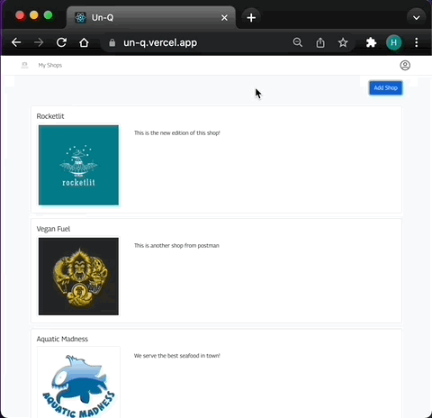
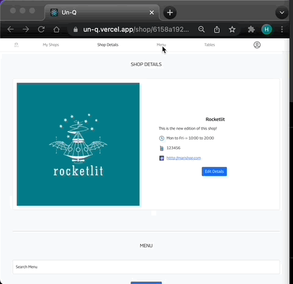
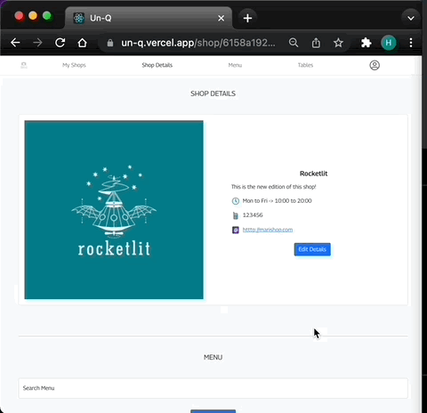
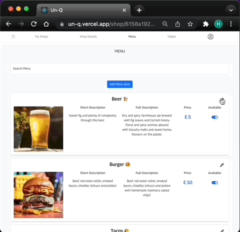
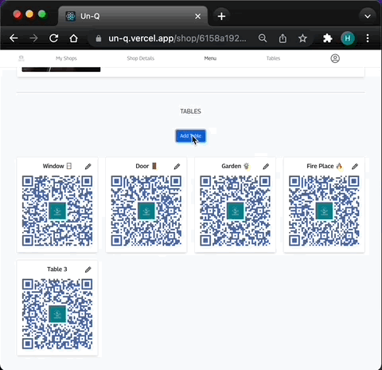

<!-- PROJECT LOGO -->
 

  <!--  -->

<h3 align="center">UnQ -> [Front-End]</h3>

  

    A Food & Drinks Ordering Application, solo capstone project developed for Strive School's Full Stack program!
     
     
    <a href="#try-customer-interface">View Demo</a>
    <!-- ·
    <a href="https://github.com/Nando-C/UnQ-FE/issues">Report Bug</a> -->
  

<!-- TABLE OF CONTENTS -->

  
Table of Contents

  <ol>
    <li>
      <a href="#about-the-project">About The Project</a>
      <ul>
        <li><a href="#built-with">Built With</a></li>
      </ul>
    </li>
    <li><a href="#app-use">App Use</a>
     <ul>
        <li><a href="#customer-interface">Customer Interface</a>
            <ul>
                <li><a href="#cart">Cart</a>
                <li><a href="#payment">Payment</a>
                <li><a href="#try-customer-interface">Try Customer Interface</a>
            </ul>
        </li>
        <li><a href="#venue-interface">Venue Interface</a>
        <ul>
                <li><a href="#details">Details</a>
                <li><a href="#menu">Menu</a>
                <li><a href="#tables">Tables</a>
                <li><a href="#sales-analysis">Sales Analysis</a>
                <li><a href="#try-venue-interface">Try Venue Interface</a>
            </ul>
        </li>
      </ul>
    </li>
    <li><a href="#contact">Contact</a></li>
  </ol>

<!-- ABOUT THE PROJECT -->

## About The Project

<!-- [![Product Name Screen Shot][product-screenshot]](https://example.com) -->

This is the Front-End of my Solo Capstone project for the Full Stack Master Camp at Strive School.

Developed completly from (not having idea of what to conceive) concept to deployment in 5 weeks, implementing both the Font-End & Back-End from scratch within this time frame.

In reality this is a MVP (Minimal Viable Product) that I am planning to improve in the near future, but still makes me really proud! 😁

You can find the Back-End repo of this project in the following link: [UnQ's BackEnd](https://github.com/Nando-C/UnQ-BE)

(<a href="#top">back to top</a>)

### Built With

- [TypeScript](https://typescriptlang.org/)
- [Node.js](https://nodejs.org/)
- [React.js](https://reactjs.org/)
- [Bootstrap](https://getbootstrap.com)
- [Redux](https://redux.js.org/)
- Love ❤️ and lots of coffee ☕️

(<a href="#top">back to top</a>)

<!-- USAGE EXAMPLES -->

## App Use

The main idea behind this application is to provide the venue with a unique QR-code per table or Point Of Service/POS (which is generated automagically by the app), so when the customer wants to place an order, simply scan the QR code select the items and pay.

So for this purpose, the app has two user interfaces:

- Customer

  Used by the customers to order and pay for Food & Drinks and designed to be only mobile.

  

- Venue / Shop

  Used by the venue's/shop's staff to create and edit the place profile, i.e contact details, modify the menu, create table/POS QR-codes (and in the next version, get some sales analysis).

  

(<a href="#top">back to top</a>)

### Customer Interface

- Ideally you will land here by having scaned a venue's QR-code on your mobile, which places you right in the specific table/POS your are sitting within the venue/shop.

- You will see the venue's availble menu and will be able to add items to the cart right away.

    

- In case you land here following different route, you will have a list of venues to choose from. Then you'll have to first select the table/POS you are sitting, before being able to add items to the cart.

    

(<a href="#top">back to top</a>)

#### Cart

- On the cart, you have the option to select all items and pay for the full bill or select the quantities of the ones you want to pay for, to share the bill with your friends. In the second case, your friends can scan the QRcode with their phones to select the remaining items, or use the same phone to do so and pay with their own card.

    

(<a href="#top">back to top</a>)

#### Payment

- As for payment options, you can use your paypal account or your prefered Debit or Credit Card.

    

(<a href="#top">back to top</a>)

#### Try Customer Interface

- As mentioned before, this interface has been designed to be mobile only.

- The best way is to access the app through the following QR-code, by scaning it with your mobile's phone camera. (Or tap it, if you are viewing this on a phone). This simulates that you are scanning a QR-code on the Fire Place 🔥 table of the Rocketlit venue (fictional place).

  

- When you try to add an item to the cart, you will be prompted to login/sign up. You can create an account if you wish, or you can use the following details.

        Email address: frank@mail.com
        Password: 1234

  ### Note:

  If your are using Safari, you will have to disable cross site tracking while trying this app. Unfortunately this is an issue with authentication that I still yet to solve, but I assure you there is nothing dodgy behind.
  On Chrome it works perfectly fine. 😉

        Settings -> Safari -> Prevent Cross-Site Tracking

- You can test payments using the following paypal demo account details:

        user: test@unq.com
        password: 12345678

(<a href="#top">back to top</a>)

### Venue Interface

- When a user login with a venue's manager account, a list of your venues/shops will be displayed (in case you have many branches) and a button to create a new one if you are expanding or participating on a pop-up market.

    

- Once a particular venue has been selected, you have access its details, menu and available tables sections.

    

(<a href="#top">back to top</a>)

#### Details

- On the details section, you will be able to update the venue's information and/or delete the venue (i.e: if the pop-up market has finished)

    

(<a href="#top">back to top</a>)

#### Menu

- On the Menu section, you have a search bar to quickly fin a specif item, a button to add a new item and the list of items on your menu.

- Also, on each item you have a toggle button to quickly change the availability of that item in case you run out of stock.

    

(<a href="#top">back to top</a>)

#### Tables

- On the tables section, you can create a new table by giving it a name, and the app will automatically generate a unique QR-code, customised with the image/ of the venue. This QR-code then can be saved and printed to place it in the respective location.

    

(<a href="#top">back to top</a>)

#### Sales Analysis

An insight into product sales performance of the venue will be availble in the next release.

🛠 Watch this space! 👀

(<a href="#top">back to top</a>)

#### Try Venue Interface

- To try the venue interface, you can open the app on the following link

  [UnQ](https://un-q.vercel.app/)

- Login with the the following details:

        Email address: manager@mail.com
        Password: test

  ### Note:

  If your are using Safari, you will have to disable cross site tracking while trying this app. Unfortunately this is an issue with authentication that I still yet to solve, but I assure you there is nothing dodgy behind.
  On Chrome it works perfectly fine. 😉

        On a laptop:
        Safari -> Preferences -> Privacy -> Website Tracking: Un-Check Prevent cross-site tracking

        On an iPhone:
        Settings -> Safari -> Prevent Cross-Site Tracking

(<a href="#top">back to top</a>)

<!-- CONTACT -->

## Contact

[@Nando](https://hernando-crespo.vercel.app/) - I think this is amazing but I might be biased! So get in touch and let me know what do you think of this project! 😉

(<a href="#top">back to top</a>)

