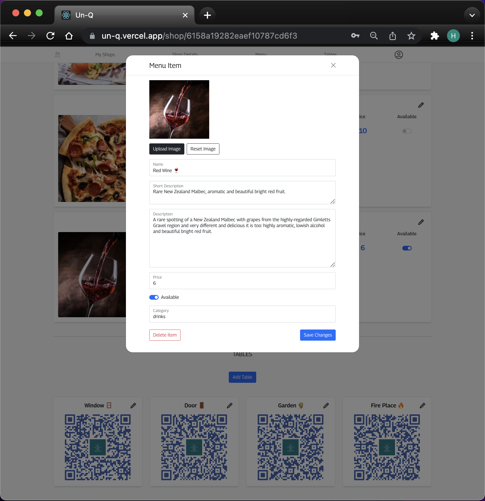
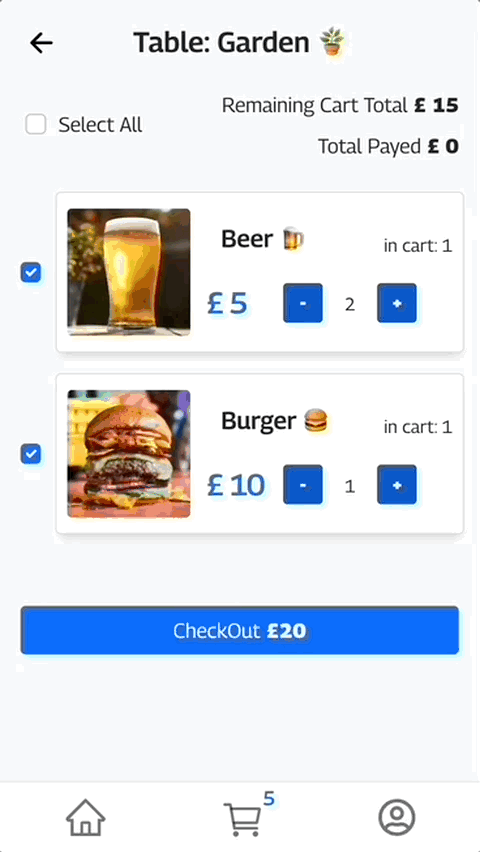

<!-- PROJECT LOGO -->
 

  <!--  -->

<h3 align="center">UnQ -> [Front-End]</h3>

  

    A Food & Drinks Ordering Application, solo capstone project developed for Strive School's Full Stack program!
     
     
    <a href="https://un-q.vercel.app/">View Demo</a>
    <!-- ·
    <a href="https://github.com/Nando-C/UnQ-FE/issues">Report Bug</a> -->
  

<!-- TABLE OF CONTENTS -->

  
Table of Contents

  <ol>
    <li>
      <a href="#about-the-project">About The Project</a>
      <ul>
        <li><a href="#built-with">Built With</a></li>
      </ul>
    </li>
    <li><a href="#app-use">App Use</a>
     <ul>
        <li><a href="#customer-interface">Customer Interface</a></li>
        <li><a href="#venue-interface">Venue Interface</a></li>
      </ul>
    </li>
    <li><a href="#contact">Contact</a></li>
  </ol>

<!-- ABOUT THE PROJECT -->

## About The Project

<!-- [![Product Name Screen Shot][product-screenshot]](https://example.com) -->

This is the Front-End of my Solo Capstone project for the Full Stack Master Camp at Strive School.

Developed completly from (not having idea of what to conceive) concept to deployment in 5 weeks, implementing both the Font-End & Back-End from scratch within this time frame.

In reality this is a MVP (Minimal Viable Product) that I am planning to improve in the near future, but still makes me really proud! 😁

You can find the Back-End repo of this project in the following link: [UnQ's BackEnd](https://github.com/Nando-C/UnQ-BE)

(<a href="#top">back to top</a>)

### Built With

- [TypeScript](https://typescriptlang.org/)
- [Node.js](https://nodejs.org/)
- [React.js](https://reactjs.org/)
- [Bootstrap](https://getbootstrap.com)
- [Redux](https://redux.js.org/)
- Love ❤️ and lots of coffee ☕️

(<a href="#top">back to top</a>)

<!-- USAGE EXAMPLES -->

## App Use

The main idea behind this application is to provide the venue with a unique QR-code per table or Point Of Service/POS (which is generated automagically by the app), so when the customer wants to place an order, simply scan the QR code select the items and pay.

So for this purpose, the app has two user interfaces:

- Customer

  Used by the customers to order and pay for Food & Drinks and designed to be only mobile.

  

- Venue / Shop

  Used by the venue's/shop's staff to create and edit the place profile, i.e contact details, modify the menu, create table/POS QR-codes (and in the next version, get some sales analisis).

  

(<a href="#top">back to top</a>)

### Customer Interface

- Ideally you will land here by having scaned a venue's QR-code on your mobile, which places you right in the specific table/POS your are within the venue/shop. You will see the venue's availble menu and can start adding items to the cart.

    

- In case you land here on a different route, you will have a list of venues to choose from. Then you'll have to first select the table/POS you are sitting, before being able to add items to the cart.

    

- On the cart, you have the option to select all items and pay for the full bill or select the quantities of the ones you want to pay for, to share the bill with your friends. In the second case, your friends can scan the QRcode with their phones to select the remaining items, or use the same phone to do so and pay with their own card.

    

- As for payment options, you can use your paypal account or your prefered Debit or Credit Card.

    

  You can test payments using the following paypal demo account details:

        user: sb-earpx8110921@personal.example.com
        password: 7--vsMqt

(<a href="#top">back to top</a>)

### Venue Interface

(<a href="#top">back to top</a>)

<!-- CONTACT -->

## Contact

[@Nando](https://hernando-crespo.vercel.app/) - Get in touch and let me know what do you think of this project! 😉

(<a href="#top">back to top</a>)

